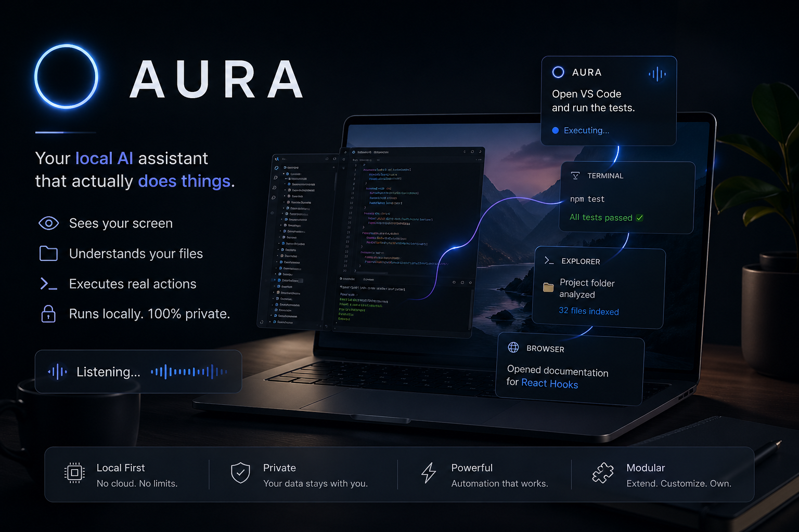

# ⚡ AURA — Autonomous Unified Response Architecture

<p align="center">
  
</p>


> A fully offline AI developer assistant that automates coding workflows using local LLMs, voice commands, and system automation — no cloud, no API keys, no subscriptions.

🔒 Fully Offline · No Cloud · No API Keys · Local LLMs · Voice-Controlled · Developer-First

<!--

-->

---

## 🚀 Project Status

- **Phase 0:** ✅ Completed
- **Phase 1:** ✅ Completed
- **Phase 2:** 🔄 In Progress

- **Phase 0** → Core system (event bus, config, registry, CLI)
- **Phase 1** → Secure execution layer (sandbox, permissions, audit, non-bypassable architecture)
- **Phase 2** → Intelligence layer (LLM, voice, tool orchestration)

The Phase-0 execution backbone (secure dispatch, argv-based subprocess with `shell=False`, command policy, path safety, npm executor, structured `CommandResult`) is built, and Phase 1 closed it with the non-bypassable `CommandRegistry` pipeline, tamper-evident audit chain, plugin manifest binding, rate limiting, and sandboxed worker isolation. The system is **production-ready for the Phase 0 + Phase 1 scope**; Phase 2 (voice, local LLM, orchestration) is now the active work.

| Phase | Description | Status | ETA |
|-------|-------------|--------|-----|
| Phase 0 — Project Core (INFRA) | Event bus, config loader, registry, CLI, execution backbone | ✅ Completed | — |
| Phase 1 — Foundation (System Plugin) | File / process / npm / monitor plugins, sandbox, permissions, audit chain, non-bypassable registry | ✅ Completed | — |
| Phase 2 — Voice + Intelligence Router | Whisper STT + Ollama LLM + Piper TTS + tool orchestration | 🔄 In Progress | Week 9 |
| Phase 3 — Dev Tools (Git + Docker) | Git & Docker automation | ⏳ Planned | Week 13 |
| Phase 4 — Vision (Screen Understanding) | Screen capture, OCR, visual reasoning | ⏳ Planned | Week 16 |
| Phase 5 — GUI Dashboard | PyQt6 desktop interface | ⏳ Planned | Week 18 |
| Phase 6 — Memory + RAG | ChromaDB semantic memory + conversation history | ⏳ Planned | Week 20 |
| Phase 7 — Browser Automation | Sandboxed web automation and research | ⏳ Planned | Week 22 |
| Phase 8 — Integrations | Spotify, Weather, Calendar, Gmail bridges | ⏳ Planned | Week 24 |

---

## ✅ What You Can Do Right Now

> **Phase 1 is complete. Everything below is fully working and tested (50/56 tests passing).**

### Starting AURA

| Command | What It Does |
|---|---|
| `python -m aura` | Start the interactive REPL |
| `python -m aura --help` | Show usage info |
| `python -m aura --version` | Print version (`AURA 2.0.0`) |
| `python -m aura --yes "<command>"` | Run one command non-interactively and exit |

AURA shows your connectivity mode at startup:

```
    ___   __  ______  ___
   /   | / / / / __ \/   |
  / /| |/ / / / /_/ / /| |
 / ___ / /_/ / _, _/ ___ |
/_/  |_\____/_/ |_/_/  |_|

Autonomous Unified Response Architecture

  Mode: ONLINE ✅
```

### File Operations

| Command | Example |
|---|---|
| `create file <path>` | `create file desktop/notes.txt` |
| `delete file <path>` | `delete file ~/Documents/old.txt` |
| `rename file <old> <new>` | `rename file draft.txt final.txt` |
| `move file <src> <dst>` | `move file desktop/report.txt documents/report.txt` |
| `search files <dir> <pattern>` | `search files . *.py` |

**Path formats** — all commands accept three styles:

| Style | Example | Resolves To |
|---|---|---|
| Smart keyword | `desktop/file.txt` | `C:\Users\You\Desktop\file.txt` |
| Tilde | `~/Documents/file.txt` | `C:\Users\You\Documents\file.txt` |
| Sandbox-relative | `myproject/file.txt` | `~/AURA_SANDBOX/myproject/file.txt` |

Smart keywords: `desktop/`, `downloads/`, `documents/`, `home/`

Creating a file that already exists warns you instead of silently overwriting.

### Project Scaffolding

```
> create project desktop/my-app
Project 'my-app' created at C:\Users\You\Desktop\my-app
```

Creates: `src/`, `tests/`, `README.md`, `.gitignore`, `requirements.txt`

### Process & System

| Command | What It Does |
|---|---|
| `cpu` | Current CPU usage percentage |
| `ram` | Memory usage (used / total) |
| `list processes` | Top 25 processes by memory (PID, name, CPU%, MEM) |
| `check system health` | Reports Python, Git, Node, Docker, npm versions |
| `run command <cmd>` | Runs an allowlisted shell command (`git`, `npm`, `docker`, `echo`) |
| `kill process <name>` | Terminates a process by name (graceful not-found handling) |

### Log Inspection

| Command | What It Does |
|---|---|
| `show logs <file>` | Tails last 20 lines of a log file |
| `show logs <file> <n>` | Tails last *n* lines |
| `show logs nonexistent.log` | Clean error, no crash |

### REPL Commands

| Command | What It Does |
|---|---|
| `help` | Lists all available commands with usage |
| `exit` / `quit` | Clean exit with "Goodbye." |
| Ctrl+D | Clean EOF exit |
| Empty line | Silently re-prompts (no crash) |
| Unknown command | Shows `[UNKNOWN_COMMAND]` and continues |

### Security (transparent to user)

- **Protected paths blocked** — `C:\Windows`, `/usr`, `/etc`, etc. are unreachable
- **Shell allowlist** — only `git`, `npm`, `docker`, `echo` can be run; arbitrary code execution is blocked
- **Tamper-evident audit log** — every destructive action is hash-chained to `logs/audit.log`
- **Sandboxed by default** — plain relative paths resolve inside `~/AURA_SANDBOX`; keyword/tilde paths go to real OS locations
- **No JSON noise** — structured logs go to files only; stderr is clean

---

### Not Available Yet (Future Phases)

| Phase | Feature | Status |
|---|---|---|
| Phase 2 | Voice commands (Whisper + Piper) | In Progress |
| Phase 2 | AI/LLM reasoning (Ollama, Llama 3) | In Progress |
| Phase 3 | Git automation, Docker control | Planned |
| Phase 4 | Screen vision (OCR, visual reasoning) | Planned |
| Phase 5 | GUI dashboard (PyQt6) | Planned |
| Phase 6 | Memory across sessions (ChromaDB) | Planned |
| Phase 7 | Browser automation (Playwright) | Planned |
| Phase 8 | Spotify, Weather, Calendar, Email | Planned |

---

## 🏗️ Architecture

AURA is built as a layered pipeline where each layer is a standalone module with clear boundaries. Full detail lives in **[docs/architecture.md](docs/architecture.md)**.

```
┌─────────────────────────────────────────────────────┐
│                     INPUT LAYER                     │
│  CLI · one-shot `python -m aura "…"` · Voice (Phase 2 – in progress) │
├─────────────────────────────────────────────────────┤
│                  REASONING LAYER                    │
│   Command Dispatcher · Ollama LLM (Phase 2 – in progress) │
├─────────────────────────────────────────────────────┤
│                  EXECUTION LAYER                    │
│  File Manager · Process Manager · npm · System Check │
├─────────────────────────────────────────────────────┤
│                  DEV TOOLS LAYER                    │
│        GitPython (Phase 3) · Docker SDK (Phase 3)   │
├─────────────────────────────────────────────────────┤
│                   OUTPUT LAYER                      │
│  Console · Piper TTS (Phase 2 – in progress) · GUI (Phase 4) │
├─────────────────────────────────────────────────────┤
│                  MEMORY LAYER                       │
│            ChromaDB (Phase 5) · Logs                │
└─────────────────────────────────────────────────────┘
```

### Project Structure

```
AURA/
├── plugins_manifest.yaml          # Authoritative plugin safety manifest
├── config.yaml.example            # Configuration template (copy to config.yaml)
│
├── aura/                          # Main-process package — core, runtime, IPC client
│   ├── __main__.py                # ``python -m aura`` entry point
│   ├── cli.py                     # CLI bootstrap + REPL / one-shot
│   ├── core/                      # Infrastructure + security primitives
│   │   ├── event_bus.py           # Pub/sub event bus
│   │   ├── mode_monitor.py        # Online/offline state tracker (Phase 2)
│   │   ├── config_loader.py       # YAML + env override loader (strict validation)
│   │   ├── logger.py              # Structured JSON logger
│   │   ├── errors.py              # Typed error hierarchy (AuraError, …)
│   │   ├── error_handler.py       # Centralized error-to-message translator
│   │   ├── intent.py              # Intent dataclass (no caller-trusted source)
│   │   ├── schema.py              # CommandSpec + action-name validation
│   │   ├── param_schema.py        # Per-command parameter schema + size caps
│   │   ├── plugin_base.py         # Plugin / IntentParser contracts
│   │   ├── plugin_loader.py       # Plugin discovery and registration
│   │   ├── result.py              # CommandResult return type
│   │   ├── tracing.py             # Trace-ID context var
│   │   └── io.py                  # Input / output abstractions
│   │
│   ├── runtime/                   # Router, registry, engine, worker IPC, planner
│   ├── security/                  # Sandbox, policy, safety gate, audit, manifest
│   ├── worker/                    # Isolated execution subprocess
│   └── intents/                   # Main-process text → Intent parsers
│
├── plugins/                       # Modular plugin tree (worker-only, import-guarded)
│   ├── system/                    # File, process, npm, monitor (Phase 1)
│   ├── voice/                     # STT, TTS, Ollama client (Phase 2)
│   ├── git/                       # Git automation (Phase 3)
│   ├── docker/                    # Docker lifecycle (Phase 3)
│   ├── vision/                    # Screen understanding (Phase 4)
│   ├── memory/                    # Semantic RAG context (Phase 6)
│   ├── browser/                   # Web automation (Phase 7)
│   ├── spotify/                   # Music control (Phase 8)
│   ├── weather/                   # Weather data (Phase 8)
│   ├── calendar/                  # Schedule management (Phase 8)
│   └── gmail/                     # Email integration (Phase 8)
│
├── tests/                         # pytest suite (214 tests incl. lockdown probes)
├── docs/                          # Architecture, phase plans, design docs
├── public/                        # GitHub Pages site (deployed via pages.yml)
└── logs/                          # Runtime log output (auto-created, rotated)
```

> Active code lives under `aura/` and `plugins/`.  Each phase lands inside the same `aura/` / `plugins/` tree — see [`docs/phases.md`](docs/phases.md) for the planned layout of each.

---

## 🛠️ Tech Stack

| Layer | Technology | Status |
|---|---|---|
| Language | Python 3.10+ | ✅ Active |
| Configuration | PyYAML (`config.yaml` with fallback defaults + env overrides) | ✅ Active |
| Path Resolution | `pathlib` (centralized via `path_utils`) | ✅ Active |
| File I/O | `pathlib`, `shutil` | ✅ Active |
| Process Control | `subprocess` (argv, `shell=False`), `psutil` | ✅ Active |
| Logging | `logging` (stdlib, `RotatingFileHandler`) | ✅ Active |
| Speech-to-Text | Whisper | 🔄 Phase 2 (in progress) |
| Local LLM | Ollama (Llama 3) | 🔄 Phase 2 (in progress) |
| Text-to-Speech | Piper TTS | 🔄 Phase 2 (in progress) |
| Version Control | GitPython | ⏳ Phase 3 |
| Containers | Docker SDK | ⏳ Phase 3 |
| GUI Framework | PyQt6 | ⏳ Phase 4 |
| Vector Memory | ChromaDB | ⏳ Phase 5 |

---

## 🚀 Getting Started

### Prerequisites

- Python 3.10 or newer

### Install

```bash
git clone https://github.com/aryanjsx/AURA.git
cd AURA
pip install -r requirements.txt
```

### Configure

A working `config.yaml` ships with the repo so AURA boots out of the box. To reset it to defaults:

```bash
cp config.yaml.example config.yaml
```

Edit `config.yaml` to customize protected paths, logging levels, shell timeouts, model routing, and LLM backends. The config loader validates all required keys on boot and **exits immediately if `config.yaml` is missing or malformed** -- the fallback template `config.yaml.example` is used only when no `config.yaml` exists.

Optional environment overrides (see `config_loader` docstring): `AURA_LOG_PATH`, `AURA_SHELL_TIMEOUT`, `AURA_PROTECTED_PATHS`.

### Run

**Interactive REPL**

```bash
python -m aura
```

**Single-command mode** (auto-confirms, runs one command, exits)

```bash
python -m aura --yes "cpu"
python -m aura --yes "create file desktop/hello.txt"
python -m aura --yes "system health"
```

**Example session:**

```
> create file desktop/hello.txt
File created: C:\Users\You\Desktop\hello.txt

> create file desktop/notes.txt
File created: C:\Users\You\Desktop\notes.txt

> move file desktop/notes.txt documents/notes.txt
Moved: C:\Users\You\Desktop\notes.txt -> C:\Users\You\Documents\notes.txt

> check system health
System Health:
  python     : Python 3.14.0
  git        : git version 2.51.1
  node       : v22.22.0
  docker     : NOT INSTALLED
  npm        : 11.6.1

> create project desktop/my-app
Project 'my-app' created at C:\Users\You\Desktop\my-app

> show logs logs/aura.log 3
Last 3 line(s) of logs/aura.log:
{"timestamp": "...", "level": "INFO", ...}
{"timestamp": "...", "level": "INFO", ...}
{"timestamp": "...", "level": "INFO", ...}

> exit
Goodbye.
```

### Quick Command Reference

| Category | Commands |
|---|---|
| **Files** | `create file <path>`, `delete file <path>`, `rename file <old> <new>`, `move file <src> <dst>`, `search files <dir> <pattern>` |
| **Projects** | `create project <path>` |
| **Monitoring** | `cpu`, `ram`, `list processes`, `check system health` |
| **Shell** | `run command <cmd>` (allowlisted: `git`, `npm`, `docker`, `echo`) |
| **Processes** | `kill process <name>` |
| **Logs** | `show logs <file> [n]` |
| **npm** | `npm install [path]`, `npm run <script> [path]` |
| **REPL** | `help`, `exit`, `quit` |

> All paths support `~`, smart keywords (`desktop/`, `downloads/`, `documents/`, `home/`), and sandbox-relative paths.

---

## 📋 Roadmap

See [ROADMAP.md](ROADMAP.md) for the detailed phase breakdown.

| Phase | What Ships | Key Tech |
|---|---|---|
| **Phase 0 — Project Core (INFRA)** ✅ | Event bus, config, registry, CLI, execution backbone | Python, PyYAML |
| **Phase 1 — Foundation (System Plugin)** ✅ | File/process/npm/monitor plugins, sandbox, permissions, audit chain, non-bypassable registry | subprocess (argv), psutil, hashlib, hmac |
| **Phase 2 — Voice + Intelligence Router** 🔄 | Offline voice + LLM + tool orchestration | Whisper, Ollama, Piper |
| **Phase 3 — Dev Tools (Git + Docker)** ⏳ | Git & Docker automation | GitPython, Docker SDK |
| **Phase 4 — Vision (Screen Understanding)** ⏳ | Screen capture, OCR, visual reasoning | LLaVA, Tesseract |
| **Phase 5 — GUI Dashboard** ⏳ | Desktop interface with live command log | PyQt6 |
| **Phase 6 — Memory + RAG** ⏳ | Semantic project context + conversation history | ChromaDB, nomic-embed-text |
| **Phase 7 — Browser Automation** ⏳ | Sandboxed web automation and research | Playwright |
| **Phase 8 — Integrations** ⏳ | Spotify, Weather, Calendar, Gmail bridges | Plugin-specific APIs |

---

## 🙋 Where We Need Help

### Phase 0 + Phase 1 — Completed (maintenance / hardening)
- Additional test coverage (npm executor, scaffolder edge cases)
- Custom `InputSource` / `OutputSink` implementations for new frontends
- Documentation improvements
- Config schema validation and documentation

### Phase 2 — In Progress (active contributions welcome)
- Whisper STT integration and optimization
- Ollama prompt engineering for developer tasks
- Piper TTS voice configuration
- LLM tool-use orchestration on top of the existing command registry

### Future (Phase 3+)
- Git automation edge cases
- Docker SDK integration
- PyQt6 dashboard components
- ChromaDB memory schema design

---

## 🤝 Contributing

Contributions, issues, and feature requests are welcome! See [CONTRIBUTING.md](CONTRIBUTING.md) for full guidelines.

**Quick start:**

1. Fork the repo
2. Create your branch (`git checkout -b feat/amazing-feature`)
3. Commit using [Conventional Commits](https://www.conventionalcommits.org/) (`feat(core): add amazing feature`)
4. Push to your branch (`git push origin feat/amazing-feature`)
5. Open a Pull Request

See the [issues tab](https://github.com/aryanjsx/AURA/issues) — look for `good first issue` and `help wanted` labels.

---

## 📄 License

This project is licensed under the [MIT License](LICENSE).

---

<p align="center">
  <b>⚡ AURA — Built offline. Powered locally. Yours completely.</b><br>
  No cloud · No API keys · No internet · Full data privacy<br><br>
  <a href="https://github.com/aryanjsx">aryanjsx</a>
</p>
